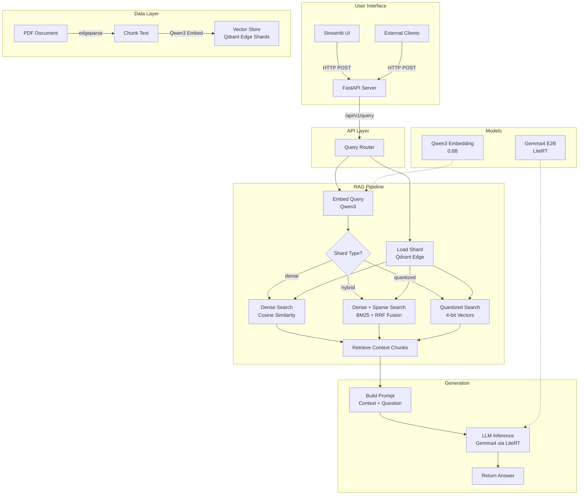

# Edge RAG

On-device Retrieval-Augmented Generation using Qdrant Edge, Qwen3 embeddings, and Gemma4.

[](https://www.python.org/downloads/)
[](LICENSE)
[](#testing)
[](#testing)
[](https://github.com/astral-sh/ruff)
[](https://fastapi.tiangolo.com/)
[](https://streamlit.io/)

**GitHub:** [Danselem/edgerag](https://github.com/Danselem/edgerag)

## Author

**Daniel Egbo** — [@Danselem](https://github.com/Danselem) on GitHub · [@egbo_sky](https://x.com/egbo_sky) on X

## Overview

Edge RAG is a fully local, offline-first Retrieval-Augmented Generation system that runs entirely on your device — no cloud APIs, no data leaving your machine. Drop in a PDF, and the system indexes it into a local vector database, then answers questions using a small but capable language model.

The project demonstrates how modern on-device AI components can be combined to build a practical RAG pipeline: a lightweight vector database (Qdrant Edge) for storage and retrieval, a compact embedding model (Qwen3 0.6B) for semantic search, and a small language model (Gemma4 E2B via LiteRT) for generation — all running on CPU without a GPU.

This makes it ideal for edge deployments, air-gapped environments, privacy-sensitive domains, or anyone who wants to build AI applications without sending data to external services.

## Architecture



## Core Concepts

### What is RAG?

**Retrieval-Augmented Generation (RAG)** is a technique that combines information retrieval with language model generation. Instead of relying solely on the model's trained knowledge, RAG first retrieves relevant documents from a knowledge base, then feeds those documents as context to the language model along with the user's question.

This approach solves a fundamental problem with large language models: **hallucination**. Without RAG, a model might generate plausible-sounding but factually incorrect answers. With RAG, the model is grounded in actual source documents, so it can cite specific data points and provide verifiable answers.

The RAG pipeline has three stages:

1. **Indexing** — Convert documents into vector embeddings and store them in a vector database
2. **Retrieval** — Given a query, find the most relevant document chunks
3. **Generation** — Feed the retrieved context to the LLM with the original question

### Edge AI vs Cloud AI

**Edge AI** means running AI inference locally on the device, rather than sending data to a cloud server. This matters for several reasons:

- **Privacy** — Your data never leaves your machine. Critical for sensitive documents, legal materials, medical records, or proprietary information.
- **Latency** — No network round-trip. Inference starts immediately.
- **Offline capability** — Works without internet. Essential for field deployments, remote locations, or air-gapped environments.
- **Cost** — No API fees. Run as many queries as you want without per-token pricing.
- **Compliance** — Meets data residency requirements when data cannot cross borders.

The trade-off is that edge models are smaller and less capable than cloud models. But for domain-specific RAG tasks, where the model only needs to answer questions about a specific document, smaller models perform surprisingly well.

### Vector Embeddings

A **vector embedding** is a numerical representation of text in a high-dimensional space. The Qwen3 embedding model converts each text chunk into a 1024-dimensional vector — a list of 1024 numbers that capture the semantic meaning of the text.

The key property of embeddings is that **semantically similar texts have similar vectors**. For example:

- "The economy grew by 3.2%" and "GDP increased 3.2 percent" would have very similar vectors
- "The economy grew by 3.2%" and "The cat sat on the mat" would have very different vectors

This enables **semantic search** — finding documents based on meaning rather than exact keyword matching. When you ask "What are the economic risks?", the system can find chunks about "GDP contraction", "recession probability", or "inflation pressure" even though none contain the exact words "economic risks".

### Dense vs Hybrid vs Quantized Retrieval

This project supports three retrieval strategies:

**Dense Retrieval** (default) uses pure semantic similarity. Both the query and document chunks are converted to embedding vectors, and the system finds chunks whose vectors are closest to the query vector using cosine distance. This is fast and captures meaning well, but may miss exact keyword matches.

**Hybrid Retrieval** combines dense (semantic) search with sparse (keyword) search using BM25. BM25 is a classical information retrieval algorithm that scores documents based on term frequency and inverse document frequency. The results from both methods are combined using **Reciprocal Rank Fusion (RRF)**, which merges ranked lists from different retrieval methods into a single ranked result. This gives the best of both worlds — semantic understanding plus keyword precision.

**Quantized Retrieval** uses 4-bit quantized vectors instead of full-precision floats. This reduces memory usage by approximately 75% (from 4 bytes per dimension to 1 byte) with minimal accuracy loss. Ideal for memory-constrained edge devices where you need to maximize the number of documents that fit in RAM.

| Strategy | Memory | Speed | Accuracy | Best For |
|----------|--------|-------|----------|----------|
| Dense | High | Fast | Good | General use |
| Hybrid | High | Medium | Best | When keyword matching matters |
| Quantized | Low | Fast | Good | Memory-constrained devices |

### Qdrant Edge

**Qdrant Edge** is a lightweight, embedded version of the Qdrant vector database designed for edge devices. Unlike the full Qdrant server, it runs in-process as a Python library — no separate server process, no network configuration, no Docker.

A Qdrant Edge **shard** is a self-contained directory containing vector data, payload data, and metadata. Shards can be created, loaded, queried, and optimized entirely within the Python process. This makes it ideal for:

- Single-user applications
- Embedded systems
- Development and prototyping
- Scenarios where running a database server is overkill

The shard format supports dense vectors, sparse vectors (for BM25), and quantized vectors, making it flexible enough to support all three retrieval strategies in this project.

### LiteRT

**LiteRT** (formerly TensorFlow Lite) is Google's runtime for deploying machine learning models on edge devices. It supports inference on mobile phones, embedded systems, and desktop computers without requiring a GPU.

The Gemma4 model in this project is packaged in `.litertlm` format — a LiteRT-specific container that bundles the model weights, tokenizer, and metadata into a single file. LiteRT handles:

- Model loading and memory management
- Hardware acceleration (CPU, GPU delegates)
- Quantized inference
- Tokenization

The `litert-lm-api` Python package provides a high-level interface for loading LiteRT models and running conversational inference, similar to how you'd use an OpenAI API but entirely local.

## What This Uses

| Component | Purpose | Source |
|-----------|---------|--------|
| **Qdrant Edge** | Local vector database | `qdrant-edge-py` |
| **Qwen3 Embedding** | Text → 1024-dim vectors | `Qwen/Qwen3-Embedding-0.6B` |
| **Gemma4 E2B** | Text generation (2B params) | `litert-community/gemma-4-E2B-it-litert-lm` |
| **edgeparse** | PDF → Markdown conversion | `edgeparse` |
| **sentence-transformers** | Embedding model wrapper | `sentence-transformers` |
| **LiteRT** | On-device ML runtime | `litert-lm-api` |
| **FastAPI** | REST API server | `fastapi` + `uvicorn` |
| **Streamlit** | Chat web UI | `streamlit` |
| **Pydantic** | Config validation + API models | `pydantic` |
| **uv** | Fast Python package manager | `uv` |

## Project Structure

```
edgerag/
├── config.yaml                  # All settings: models, paths, parameters
├── pyproject.toml               # Project metadata and dependencies
├── requirements.txt             # Pinned dependencies for uv
├── Makefile                     # All run commands (make help to list)
├── LICENSE                      # MIT
│
├── pdf/                         # Source documents for indexing
│   └── mid-year-outlook-2026.pdf
│
├── models/                      # Downloaded model files (gitignored)
│   ├── qwen3_embed/             # Qwen3 embedding model (~1.2GB)
│   └── gemma4/
│       └── gemma-4-E2B-it.litertlm  # Gemma4 LLM (~2.5GB)
│
├── shards/                      # Built vector indexes (gitignored)
│   ├── dense/                   # Dense-only index
│   ├── hybrid/                  # Dense + sparse index
│   └── quantized/               # 4-bit quantized index
│
└── src/
    ├── __init__.py
    ├── config.py                # Loads config.yaml, Pydantic validation
    ├── prompts.py               # System prompt for the LLM
    ├── base.py                  # Shared: chunk_text, load_embedder, parse_document
    ├── utils.py                 # Utility: silence_stderr
    │
    ├── download_models.py       # Download embedding + LLM from HuggingFace
    │
    ├── index_dense.py           # Build dense vector index
    ├── index_hybrid.py          # Build hybrid (dense+sparse) index
    ├── index_quantized.py       # Build 4-bit quantized index
    │
    ├── rag_dense.py             # CLI RAG inference (dense)
    ├── rag_hybrid.py            # CLI RAG inference (hybrid)
    ├── rag_quantized.py         # CLI RAG inference (quantized)
    │
    ├── ui.py                    # Streamlit chat UI
    │
    └── api/
        ├── __init__.py
        ├── app.py               # FastAPI application
        ├── routes.py            # API endpoints
        └── models.py            # Pydantic request/response models

└── tests/                       # Test suite (57 tests, 82% coverage)
    ├── conftest.py              # Shared fixtures
    ├── unit/                    # Unit tests (pure logic)
    ├── integration/             # Integration tests (FastAPI, mocked deps)
    └── e2e/                     # End-to-end tests (requires models)
```

## Prerequisites

- **Python 3.12+**
- **uv** package manager ([install](https://docs.astral.sh/uv/getting-started/installation/))
- **~4GB disk space** for models and index shards
- **~8GB RAM** recommended for LLM inference on CPU

## Quick Start

### 0. Clone the repository

```bash
git clone https://github.com/Danselem/edgerag.git
cd edgerag
```

### 1. Install

Creates a Python 3.12 virtual environment and installs all dependencies:

```bash
make install
```

### 2. Download models

Downloads Qwen3 embedding model (~1.2GB) and Gemma4 LLM (~2.5GB) from HuggingFace:

```bash
make download
```

### 3. Build indexes

Place your PDF in the `pdf/` directory, then build all three index variants:

```bash
make index-all
```

Or build a specific index:

```bash
make index-dense      # Fast, good accuracy
make index-hybrid     # Best accuracy, uses BM25 + dense
make index-quantized  # Lowest memory usage
```

### 4. Launch

Start both FastAPI and Streamlit together:

```bash
make start
```

- **Streamlit UI:** http://localhost:8501
- **FastAPI docs:** http://localhost:8000/docs

## Configuration

All settings live in `config.yaml` at the project root:

```yaml
embedding:
  repo_id: Qwen/Qwen3-Embedding-0.6B    # HuggingFace repo
  model_name: models/qwen3_embed          # Local path after download
  model_dim: 1024                         # Vector dimensions

llm:
  repo_id: litert-community/gemma-4-E2B-it-litert-lm
  filename: gemma-4-E2B-it.litertlm
  model_path: models/gemma4/gemma-4-E2B-it.litertlm

document:
  document_path: pdf/mid-year-outlook-2026.pdf  # PDF to index
  chunk_size: 1024                               # Characters per chunk
  overlap: 0                                     # Overlap between chunks

shard:
  dense_path: shards/dense          # Dense index location
  hybrid_path: shards/hybrid        # Hybrid index location
  quantized_path: shards/quantized  # Quantized index location
```

**To use a different PDF:** Place it in `pdf/`, update `document.document_path` in `config.yaml`, then run `make index-dense` (or `index-hybrid` / `index-quantized`).

**To swap models:** Update `repo_id`, `model_name`/`model_path`, and `model_dim` in `config.yaml`, then run `make download` followed by `make index-all`.

## Indexing Strategies

### Dense Index (`make index-dense`)

Converts each text chunk into a 1024-dimensional embedding vector using Qwen3. At query time, the query is also embedded, and chunks are ranked by cosine similarity to the query vector.

**Best for:** General-purpose use, fast retrieval, when semantic similarity is sufficient.

### Hybrid Index (`make index-hybrid`)

Builds two representations for each chunk:
- **Dense vector** (Qwen3 embedding) — captures semantic meaning
- **Sparse vector** (BM25) — captures keyword matching

At query time, both representations are searched in parallel, and results are combined using Reciprocal Rank Fusion (RRF) with `k=60`. This means a document that ranks well in either dense OR sparse search will appear near the top.

**Best for:** When both meaning and exact keywords matter (e.g., searching for specific terms like "Strait of Hormuz" alongside conceptual queries like "geopolitical risks").

### Quantized Index (`make index-quantized`)

Same as dense, but vectors are stored in 4-bit quantized format instead of full-precision floats. Uses TurboQuant with `always_ram=True` for fast quantized inference.

**Best for:** Memory-constrained edge devices, large document collections where fitting vectors in RAM is critical.

## Usage

### Make Targets

Run `make help` to see all available commands:

| Command | Description |
|---------|-------------|
| `make init` | Create venv + install dependencies |
| `make install` | Install dependencies into existing venv |
| `make download` | Download embedding + LLM models |
| `make index-dense` | Build dense vector index |
| `make index-hybrid` | Build hybrid (dense+sparse) index |
| `make index-quantized` | Build 4-bit quantized index |
| `make index-all` | Build all three index variants |
| `make rag-dense` | Run CLI RAG inference (dense) |
| `make rag-hybrid` | Run CLI RAG inference (hybrid) |
| `make rag-quantized` | Run CLI RAG inference (quantized) |
| `make start` | Launch FastAPI + Streamlit together |
| `make api` | Launch FastAPI only (port 8000) |
| `make ui` | Launch Streamlit only (requires FastAPI) |
| `make lint` | Run ruff linter |
| `make fmt` | Format code with ruff |
| `make test` | Run unit + integration tests |
| `make test-unit` | Run unit tests only |
| `make test-integration` | Run integration tests only |
| `make test-e2e` | Run e2e tests (requires models) |
| `make test-cov` | Run tests with coverage report |
| `make clean` | Remove venv, caches, and shard data |

### CLI Inference

Each index type has a corresponding CLI script for quick testing:

```bash
make rag-dense      # Uses dense index
make rag-hybrid     # Uses hybrid index
make rag-quantized  # Uses quantized index
```

All scripts run the same question: "What are the key risks to the global economy?" — change it in the script's `main()` function.

### API

Start the FastAPI server:

```bash
make api
```

**Query the RAG:**

```bash
curl -X POST http://localhost:8000/api/v1/query \
  -H "Content-Type: application/json" \
  -d '{"query": "What are the key risks?", "shard_type": "dense", "limit": 3}'
```

**Response:**

```json
{
  "answer": "The key risks to the global economy include...",
  "context": ["chunk text..."],
  "metadata": {
    "shard_type": "dense",
    "limit": 3,
    "document": "mid-year-outlook-2026.pdf"
  }
}
```

**Health check:**

```bash
curl http://localhost:8000/api/v1/health
# {"status":"ok","version":"0.1.0"}
```

**Get config:**

```bash
curl http://localhost:8000/api/v1/config
# {"embedding_model":"Qwen/Qwen3-Embedding-0.6B","llm_model":"...","shard_types":["dense","hybrid","quantized"]}
```

### Streamlit UI

Start both services:

```bash
make start
```

Features:
- Chat interface with conversation history
- Sidebar to select index type (dense/hybrid/quantized)
- Adjustable retrieval limit (1-10 chunks)
- "Retrieved context" expander to see what the model retrieved
- API connection status indicator
- Clear chat button

Set `EDGE_RAG_API_URL` environment variable if the API runs on a different host:

```bash
EDGE_RAG_API_URL=http://192.168.1.100:8000 make ui
```

## API Reference

### `POST /api/v1/query`

Query the RAG system.

**Request:**

| Field | Type | Default | Description |
|-------|------|---------|-------------|
| `query` | string | required | Question to ask |
| `shard_type` | string | `"dense"` | `"dense"`, `"hybrid"`, or `"quantized"` |
| `limit` | int | `2` | Number of context chunks (1-10) |

**Response:**

| Field | Type | Description |
|-------|------|-------------|
| `answer` | string | Generated answer |
| `context` | string[] | Retrieved text chunks |
| `metadata` | object | Shard type, limit, document name |

### `GET /api/v1/health`

Returns service health status.

**Response:** `{"status": "ok", "version": "0.1.0"}`

### `GET /api/v1/config`

Returns current configuration.

**Response:** `{"embedding_model": "...", "llm_model": "...", "document": "...", "shard_types": [...]}`

## Testing

The project follows the **test pyramid** pattern: many fast unit tests, fewer integration tests, and opt-in end-to-end tests.

### Test Structure

```
tests/
├── conftest.py                  # Shared fixtures
├── unit/                        # Pure logic, no external deps
│   ├── test_base.py             # chunk_text, parse_document
│   ├── test_config.py           # Pydantic models, resolve()
│   ├── test_utils.py            # silence_stderr
│   ├── test_prompts.py          # SYSTEM_PROMPT
│   └── test_api_models.py       # Request/response validation
├── integration/                 # FastAPI endpoints (mocked deps)
│   ├── test_api_routes.py       # API contract tests
│   └── test_download_models.py  # HuggingFace calls (mocked)
└── e2e/                         # Full pipeline (requires models)
    └── test_rag_pipeline.py
```

### Running Tests

| Command | What it runs |
|---------|--------------|
| `make test` | Unit + integration tests |
| `make test-unit` | Unit tests only (fast, <1s) |
| `make test-integration` | Integration tests only |
| `make test-e2e` | E2E tests (requires models on disk) |
| `make test-cov` | Tests + coverage report |

### Coverage

Coverage is enforced at **70%** for the testable core modules:
- `config.py`, `base.py`, `utils.py`, `prompts.py`
- `api/app.py`, `api/models.py`, `api/routes.py`

Modules requiring real models (`index_*.py`, `rag_*.py`, `ui.py`) are excluded from coverage and tested via e2e tests.

### Writing Tests

- Unit tests go in `tests/unit/`
- Integration tests (FastAPI, mocked deps) go in `tests/integration/`
- E2E tests (real models) go in `tests/e2e/` and are marked `@pytest.mark.e2e`
- Fixtures live in `tests/conftest.py`
- Naming: `test_<module>.py`, `test_<function>_<scenario>()`

## Architecture Deep Dive

### Indexing Pipeline

```
PDF → edgeparse (PDF→Markdown) → chunk_text (split into 1024-char chunks)
    → Qwen3 (encode each chunk → 1024-dim vector)
    → Qdrant Edge (store vectors + text payloads)
```

1. **PDF Parsing** — `edgeparse` converts the PDF to Markdown, preserving structure
2. **Chunking** — Text is split into fixed-size chunks (default 1024 characters) with configurable overlap
3. **Embedding** — Each chunk is converted to a 1024-dimensional vector using Qwen3
4. **Storage** — Vectors and original text are stored in a Qdrant Edge shard

### Query Pipeline

```
User Query → Qwen3 (embed query) → Qdrant Edge (search shard)
           → Retrieve top-K chunks → Build prompt (context + question)
           → Gemma4 via LiteRT (generate answer) → Return response
```

1. **Query Embedding** — The user's question is converted to a vector using the same Qwen3 model
2. **Search** — The vector is used to search the Qdrant Edge shard for the most similar chunks
3. **Context Assembly** — Retrieved chunks are concatenated into a context string
4. **Prompt Construction** — The system prompt + context + question are formatted for the LLM
5. **Generation** — Gemma4 generates an answer conditioned on the retrieved context
6. **Response** — The answer is returned to the user

### Hybrid Retrieval Flow

```
User Query → Qwen3 (dense embed) ─┐
           → BM25 (sparse embed) ─┤
                                   ↓
                          Qdrant Edge Query
                          (Prefetch + RRF Fusion)
                                   ↓
                          Ranked Results → Context → LLM
```

The hybrid approach uses Qdrant Edge's prefetch mechanism to run dense and sparse searches in parallel, then combines results using Reciprocal Rank Fusion (RRF). This ensures documents that are relevant by either semantic similarity OR keyword matching appear at the top.

## Troubleshooting

| Issue | Cause | Solution |
|-------|-------|----------|
| `API not reachable` | FastAPI not running | Run `make api` or `make start` |
| `FileNotFoundError: Document not found` | PDF not in `pdf/` directory | Place PDF in `pdf/`, check `config.yaml` |
| `Model not found` | Models not downloaded | Run `make download` |
| Out of memory | Model too large for RAM | Use quantized index: `make index-quantized` |
| Slow first query | LLM loading into RAM | Normal — subsequent queries are faster |
| No output from scripts | Stderr silenced by default | Run `EDGE_RAG_VERBOSE=1 make rag-dense` |

## Environment Variables

| Variable | Default | Description |
|----------|---------|-------------|
| `EDGE_RAG_API_URL` | `http://localhost:8000` | FastAPI server URL for Streamlit |
| `EDGE_RAG_VERBOSE` | `0` | Set to `1` to show litert_lm debug output |

## Credits

- [Tarun Jain](https://github.com/TRJ_0751) ([@TRJ_0751](https://github.com/TRJ_0751)) — contributions and feedback
- [Quadrant](https://qdrant.tech/) — Qdrant Edge vector database
- [Google LiteRT](https://ai.google.dev/edge/litert) — on-device ML runtime
- [Qwen3](https://qwenlm.github.io/) — embedding model

## Contributing

1. Fork the repository
2. Create a feature branch (`git checkout -b feature/amazing-feature`)
3. Commit your changes (`git commit -m 'Add amazing feature'`)
4. Run tests (`make test`) and ensure they pass
5. Push to the branch (`git push origin feature/amazing-feature`)
6. Open a Pull Request

## License

MIT License — see [LICENSE](LICENSE) for details.
